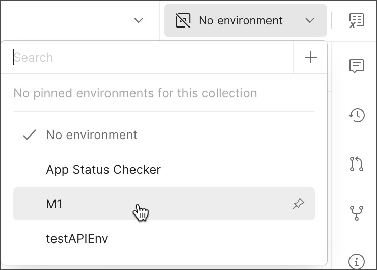

# Install instructions

## Prerequisites

- Windows, macOS, or Linux

## Step 1: Install Postman client

1. Download Postman client at https://www.postman.com/downloads/

## Step 2: Import postman collections and environment json files
2. Import the postman collections and environment via https://learning.postman.com/docs/getting-started/importing-and-exporting/importing-from-git/

Note: Another alternative would be to import Postman collection (.json) files and environment manually to the Postman client via https://learning.postman.com/docs/getting-started/importing-and-exporting/importing-data/

## Step 3: Select the imported environment before running the API tests 
3. To use the new environment, select environment named `pet_circle` from the environment selector at the top right of the workbench. This makes it the active environment and sets all variables to the values specified in the environment.

## Step 4: Run API collections via Postman runner
4. Select the postman collection to be executed manually - https://learning.postman.com/docs/collections/running-collections/intro-to-collection-runs/#configure-a-collection-run

## Step 5: Debug and monitor test execution results
5. Postman would display test execution result and all related details - https://learning.postman.com/docs/collections/running-collections/intro-to-collection-runs/#configure-a-collection-run 

## Note: Alternative method of running tests using Github actions (newman cli)
1. Go to https://github.com/CloseTheTicket/petcircle_demo/actions
2. Click on the available runner with the runner name (newman_api_test_runner)
3. Click on the `Run workflow` button on the rightmost part of the page
4. On the displayed popup click `Run workflow` button in green background color
